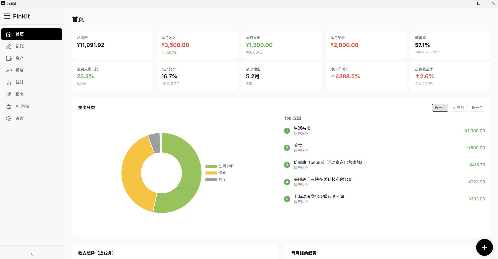
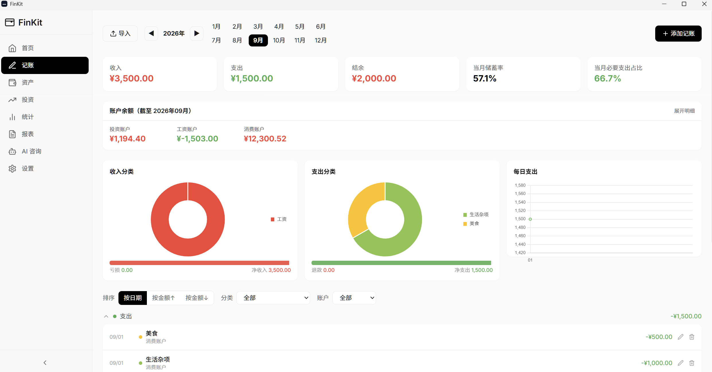
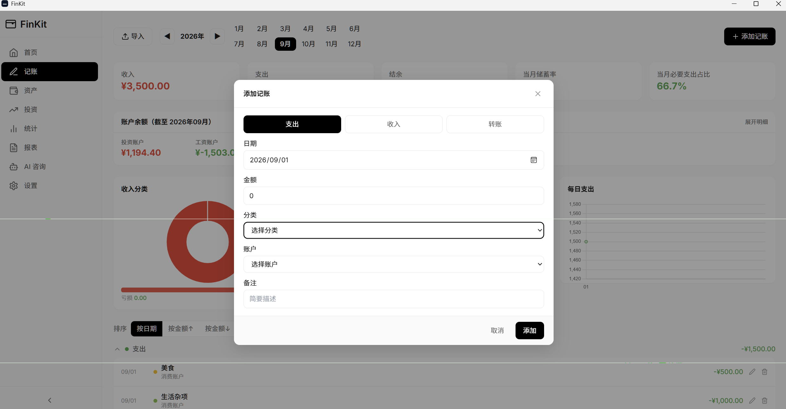
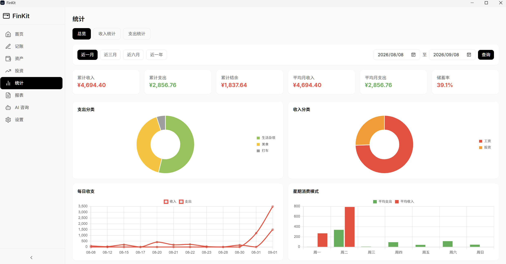
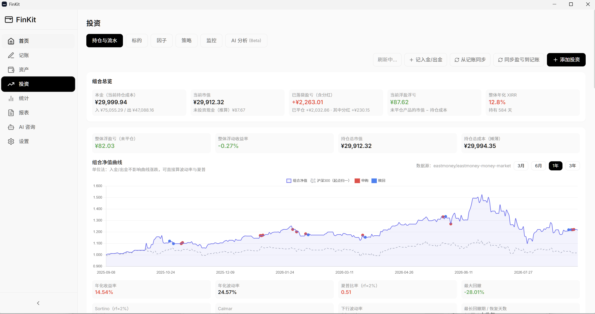
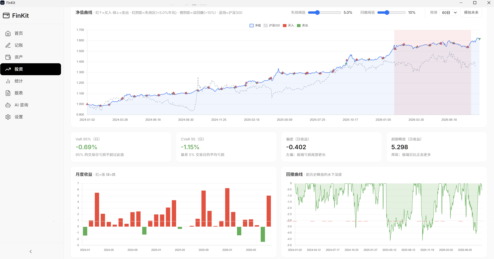
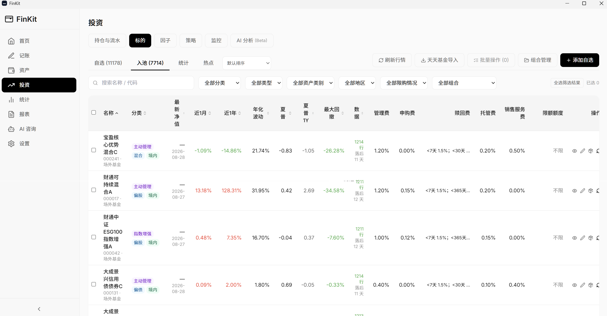
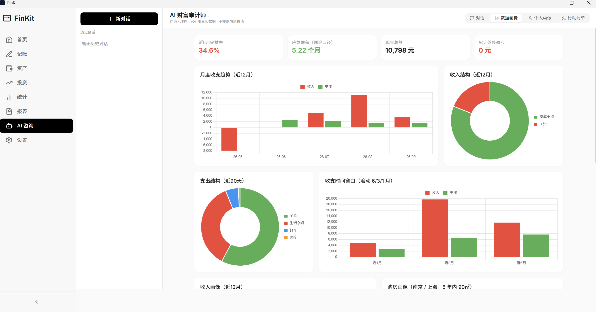
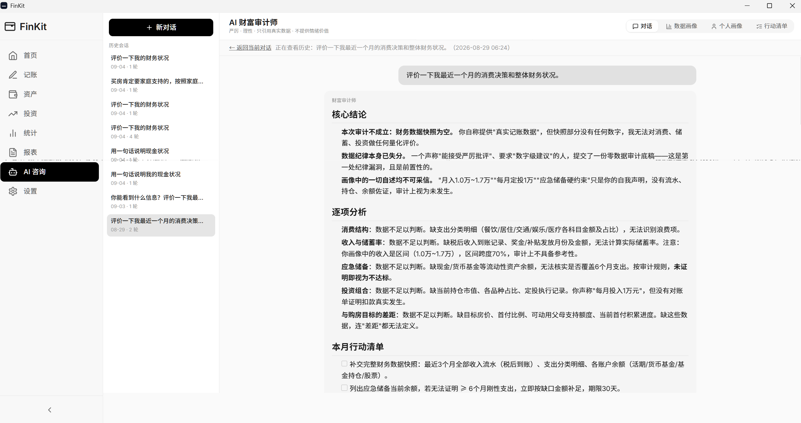

# FinKit (TT_FinKit)

自托管个人财富管理应用。了解你的钱花在哪、怎么挣的。

属于 **TT** 应用系列 —— 自托管、本地优先、尊重隐私的工具。

记录每一笔支出，追踪收入来源，管理投资组合，回测交易策略 —— 全在你自己的机器上完成。

## 🎯 FinKit 是什么？

FinKit 是一套完整的个人财务管理工具：

- **看懂消费** — 用分类、标签、地点记录每一笔支出
- **掌握现金流** — 实时看板显示收支对比、储蓄率、净资产趋势
- **管理投资** — 记录买卖，追踪 XIRR，可视化组合表现
- **回测策略** — 内置回测引擎，70+ 因子，预置策略开箱即用
- **AI 洞察** — 基于新闻的智能分析，由大语言模型驱动

数据本地存储，不上云，无遥测，隐私无忧。

## 📸 截图

### 首页与记账

| 首页 | 记账 |
|------|------|
|  |  |

| 记账（续） | 统计 |
|-----------|------|
|  |  |

### 投资管理

| 投资组合概览 | 回测 | 研究 |
|-------------|------|------|
|  |  |  |

### AI 分析

| AI 顾问 | AI 投资分析 |
|---------|-------------|
|  |  |

## 🛠️ 技术栈

| 层次 | 技术 |
|------|------|
| **后端** | Python 3.11+ + FastAPI |
| **数据库** | SQLite + SQLAlchemy 2.0 |
| **前端** | Vue 3 + TypeScript + Vite 5 |
| **UI** | Tailwind CSS v3 |
| **图表** | Chart.js 4 |
| **认证** | JWT + bcrypt |
| **加密** | AES-256-GCM (Fernet) |

## 📦 安装

### 环境要求
- Python 3.11+
- Node.js 18+

### 快速开始

```bash
# 后端
cd backend
python -m venv venv
venv\Scripts\activate
pip install -r requirements.txt
copy .env.example .env
# 编辑 .env — 设置 SECRET_KEY 和 ENCRYPTION_KEY
python -m uvicorn app.main:app --reload --port 8100

# 前端
cd frontend
npm install
npm run dev
```

打开 `http://localhost:8100`，注册第一个账号。

### 桌面打包（Windows）

```bash
cd frontend && npm run build && cd ..
cd backend
python scripts/build_release.py --version 0.1.0
# 发布包：release/FinKit-v0.1.0.zip
```

## 🔧 配置

复制 `backend/.env.example` 到 `backend/.env`：

```env
SECRET_KEY=your-secret-key-here
ENCRYPTION_KEY=your-encryption-key-here

# 可选：AI 服务
AI_INFERENCE_API_URL=https://api.openai.com/v1
AI_INFERENCE_API_KEY=sk-...
AI_INFERENCE_MODEL=gpt-4o-mini

# 可选：iFinD（同花顺）行情数据
IFIND_USERNAME=
IFIND_PASSWORD=
```

## 🧪 测试

```bash
cd backend
python -m pytest  # 272 个测试
```

## 🔒 隐私

- **本地优先**：所有数据存储在本地 SQLite
- **加密存储**：敏感字段使用 AES-256-GCM
- **无遥测**：数据不出你的机器
- **多用户隔离**：JWT 认证，完全的数据隔离

## 📝 许可证

MIT 许可证 — 详见 [LICENSE](LICENSE)。

---

English README: [README.md](README.md)

*免责声明：本工具仅供个人财务管理参考。用户需对自己的数据准确性和投资决策负责。*